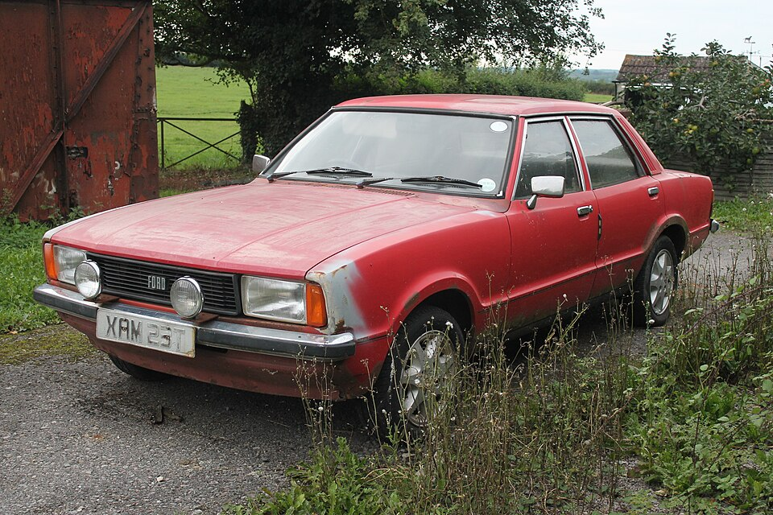
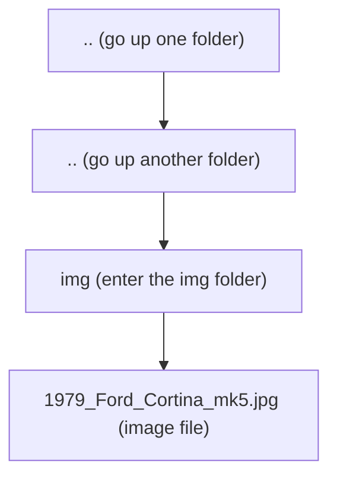

# Section 1

[Link button](#){: .btn }

[Link button](#){: .btn .btn-purple }

[Link button](#){: .btn .btn-blue }

[Link button](#){: .btn .btn-green }

[Link button](#){: .btn .btn-outline }

Use `` 

File paths explained

```

```




```
→ Move up one folder level.

../../ → Move up two folder levels.

img/ → Go into the folder named img.

1979_Ford_Cortina_mk5.jpg → To present image on page.
```


[Photo by Charles on Flickr](https://www.flickr.com/photos/92622665@N08/9743021018)

[Creative Commons Attribution 2.0 Generic license.](https://creativecommons.org/licenses/by/2.0/deed.en)

