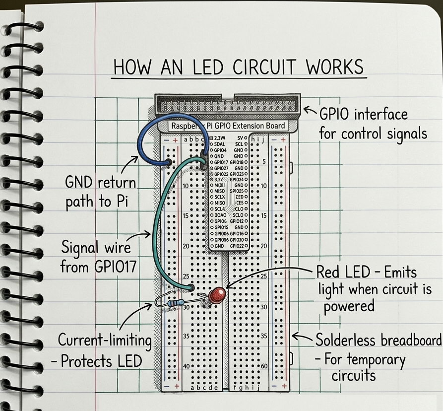

# Raspberry Pi Tutorials

This collection of basic Raspberry Pi tutorials introduces newcomers to simple, hands‑on electronics projects. Starting with essentials such as blinking an LED, reading button inputs, and using GPIO pins safely, each guide walks through the fundamentals step by step. The tutorials are designed to build confidence with both the hardware and the Python code that drives it, making them ideal for anyone taking their first steps into physical computing.